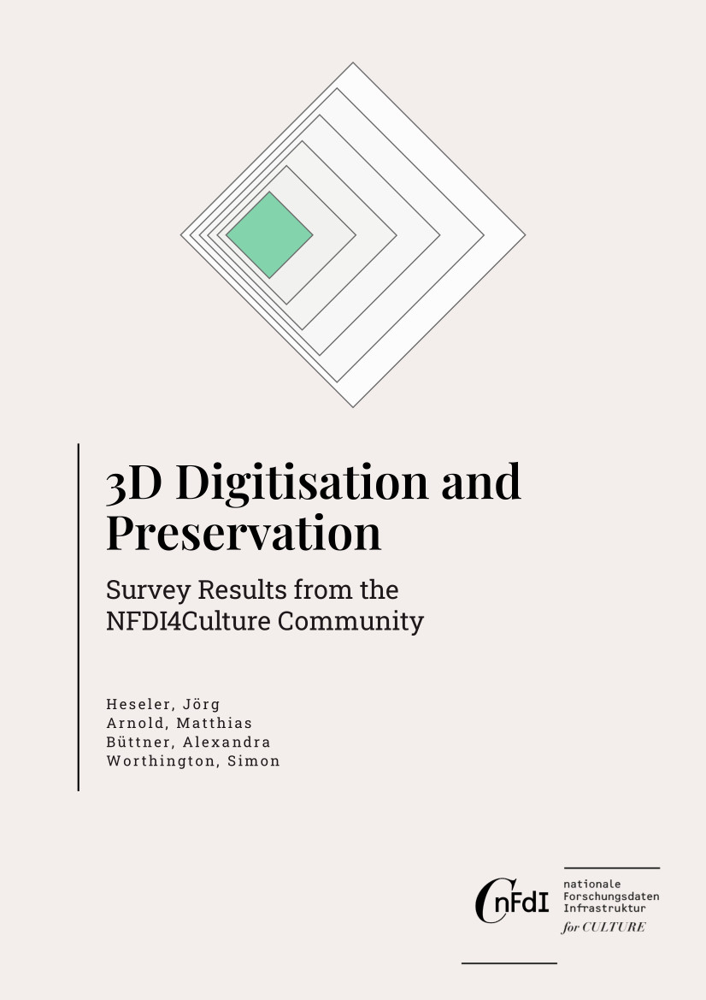

## 3D Digitisation and Preservation – Survey Results from the NFDI4Culture Community

by Jörg Heseler , Matthias Arnold , Alexandra Büttner , and Simon Worthington 

v1.0

 > German translation: [Erstellung, Nutzung und Handhabung von 3D-Modellen – Umfrageergebnisse aus der NFDI4Culture Community](https://nfdi4culture.github.io/3d-umfrageergebnisse-de/)

<picture>
 <source media="(prefers-color-scheme: dark)" srcset="cover/cover-small.jpg">
 <source media="(prefers-color-scheme: light)" srcset="cover/cover-small.jpg">
 
</picture>

One of the project goals of NFDI4Culture, [Task Area Data Publication and Availability (TA4)](https://nfdi4culture.de/what-we-do/task-areas/task-area-4.html), is the development of concepts for central long term preservation services to ensure a sustainable infrastructure. In particular, publications from cultural disciplines with 3D data are in the foreground. The requirements for developing a concept are the needs of producers, providers and administrators of research data. One measure of this needs assessment was the implementation of a survey on the creation, use and handling of 3D models, the results of which are discussed below.
### Cite as

Heseler, Jörg; Arnold, Matthias; Büttner, Alexandra; and Worthington, Simon. 2023. ‘Creation, Use and Handling of 3D Models – Survey Results from the NFDI4Culture Community’. Digital Publications and Data Working Group (NFDI4Culture). [https://doi.org/10.5281/zenodo.8033413](https://doi.org/10.5281/zenodo.8033413)

© The Authors.

 This work is licensed under a <a rel="license" href="http://creativecommons.org/licenses/by/4.0/">Creative Commons Attribution 4.0 International License</a>.
